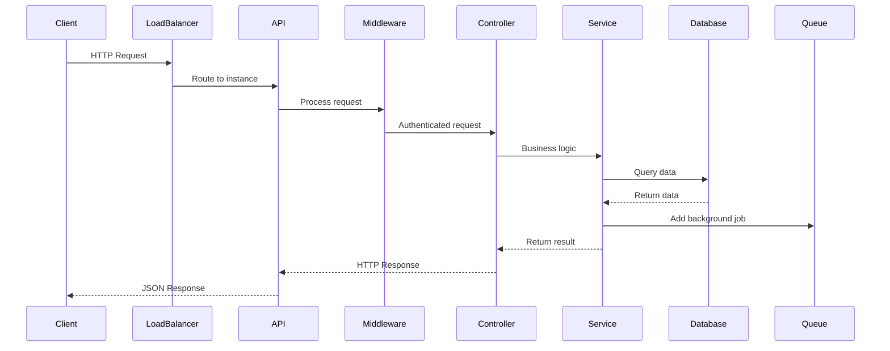
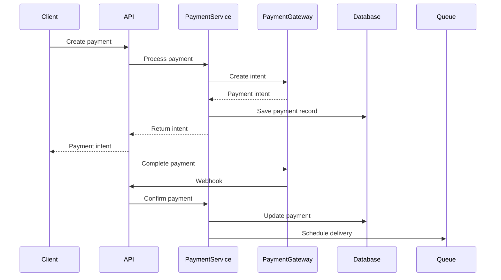

# Architecture & System Design - Interview Preparation

## Overview

This document covers the overall system architecture, design patterns, and architectural decisions made in the Gift Card SaaS Platform.

---

## System Architecture Overview

### High-Level Architecture

```
┌─────────────┐         ┌─────────────┐         ┌─────────────┐
│   Client    │────────▶│   Next.js   │────────▶│   Express   │
│  (Browser)  │         │   Frontend  │         │    API      │
└─────────────┘         └─────────────┘         └─────────────┘
                                                       │
                                                       ▼
                        ┌─────────────────────────────────────┐
                        │         PostgreSQL                  │
                        │      (Primary Database)            │
                        └─────────────────────────────────────┘
                                 │
                        ┌────────┴────────┐
                        ▼                 ▼
                ┌──────────────┐   ┌──────────────┐
                │    Redis     │   │   BullMQ     │
                │  (Cache/    │   │  (Queues)    │
                │  Sessions)  │   │              │
                └──────────────┘   └──────────────┘
```

### Architecture Pattern: Monolithic with Queue System

**Decision:** Monolithic backend with queue-based background jobs

**Why Monolith?**
- **Simplicity:** Easier to develop, test, and deploy
- **Performance:** No network overhead between services
- **Transactions:** Easier to maintain ACID transactions across features
- **Team Size:** Small team, monolith is more manageable
- **Deployment:** Single deployment unit, simpler operations

**Why Not Microservices?**
- **Complexity:** More complex deployment, monitoring, debugging
- **Network Overhead:** Inter-service communication adds latency
- **Distributed Transactions:** Harder to maintain consistency
- **Over-engineering:** Not needed for current scale

**Future Consideration:** Can split into microservices when:
- Team grows significantly
- Different services need independent scaling
- Clear service boundaries emerge

---

## Backend Architecture Patterns

### 1. MVC Pattern (Modified)

**Structure:**
```
Routes → Controllers → Services → Database (Prisma)
```

**Implementation:**

**Routes Layer** (`routes/`)
- Define API endpoints
- Route to controllers
- Apply middleware (auth, validation, rate limiting)

**Controllers Layer** (`controllers/`)
- Handle HTTP requests/responses
- Extract request data
- Call services
- Format responses
- Handle errors

**Services Layer** (`services/`)
- Business logic
- Data validation
- Database operations
- External API calls
- Complex operations

**Database Layer** (Prisma)
- Data access
- Query building
- Type-safe database operations

**Code Example:**
```typescript
// Route
router.post('/gift-cards', authenticate, validate(createSchema), controller.create);

// Controller
async create(req: AuthRequest, res: Response) {
  const data = req.body;
  const giftCard = await giftCardService.create(data);
  res.json({ success: true, data: giftCard });
}

// Service
async create(data: CreateGiftCardData) {
  // Business logic
  const code = generateGiftCardCode();
  return prisma.giftCard.create({ data: { ...data, code } });
}
```

**Interview Talking Points:**
- Clear separation of concerns
- Controllers are thin (just HTTP handling)
- Services contain business logic
- Easy to test each layer independently
- Follows single responsibility principle

---

### 2. Service Layer Architecture

**Purpose:** Centralize business logic, separate from HTTP concerns

**Benefits:**
- **Reusability:** Services can be used by controllers, jobs, other services
- **Testability:** Easy to unit test business logic
- **Maintainability:** Business logic in one place
- **Consistency:** Consistent business rules across the app

**Service Organization:**
```
services/
├── auth.service.ts              # Authentication logic
├── giftcard.service.ts          # Gift card operations
├── payment/
│   ├── payment.service.ts       # Payment orchestration
│   ├── stripe.service.ts       # Stripe integration
│   └── paypal.service.ts       # PayPal integration
├── delivery/
│   ├── delivery.service.ts     # Delivery orchestration
│   ├── email.service.ts        # Email delivery
│   └── sms.service.ts          # SMS delivery
└── ...
```

**Code Example:**
```typescript
// Service orchestrates multiple operations
export class PaymentService {
  async createPayment(data: CreatePaymentData) {
    // 1. Validate data
    // 2. Calculate commission
    // 3. Create payment intent with gateway
    // 4. Create payment record
    // 5. Track IP address
    // 6. Return result
  }
}
```

**Interview Talking Points:**
- Services encapsulate business logic
- Can be reused by controllers, jobs, webhooks
- Easy to test in isolation
- Single source of truth for business rules

---

### 3. Middleware Chain Pattern

**Purpose:** Process requests through a chain of middleware functions

**Middleware Order:**
1. CORS handling
2. Security headers (Helmet)
3. Compression
4. Body parsing
5. Session management
6. CSRF token generation
7. Request logging
8. Rate limiting
9. Authentication
10. Authorization
11. Validation
12. Route handlers
13. Error handling

**Code Example:**
```typescript
// Middleware chain in app.ts
app.use(cors(corsOptions));           // 1. CORS
app.use(helmet());                    // 2. Security headers
app.use(compression());               // 3. Compression
app.use(cookieParser());              // 4. Cookies
app.use(sessionMiddleware);           // 5. Sessions
app.use(attachCSRFToken);            // 6. CSRF token
app.use(requestLogger);               // 7. Logging
app.use(apiRateLimiter);              // 8. Rate limiting
app.use('/api/v1/gift-cards', authenticate); // 9. Auth
app.use('/api/v1/gift-cards', authorize('MERCHANT')); // 10. Authorization
```

**Interview Talking Points:**
- Middleware processes requests in order
- Each middleware has specific responsibility
- Can skip middleware for specific routes
- Error middleware catches all errors

---

### 4. Repository Pattern (via Prisma)

**Purpose:** Abstract database access, provide type-safe queries

**Implementation:**
- Prisma Client acts as repository
- Type-safe queries
- Automatic query optimization
- Connection pooling handled by Prisma

**Code Example:**
```typescript
// Prisma as repository
const giftCard = await prisma.giftCard.findUnique({
  where: { id },
  include: { merchant: true, template: true },
});
```

**Benefits:**
- Type safety
- Prevents SQL injection
- Easy to test (can mock Prisma)
- Consistent query interface

---

### 5. Queue-Based Background Jobs

**Purpose:** Handle asynchronous operations without blocking API

**Queue System:** BullMQ with Redis

**Jobs Implemented:**
1. Gift card expiry processing
2. Expiry reminder emails
3. Token cleanup
4. Scheduled delivery

**Architecture:**
```
API Request → Queue Job → Worker → Process → Complete
```

**Code Example:**
```typescript
// Add job to queue
await giftCardExpiryQueue.add('expire-card', { giftCardId });

// Worker processes job
export async function processGiftCardExpiry(job: Job) {
  const { giftCardId } = job.data;
  // Process expiry logic
}
```

**Interview Talking Points:**
- Non-blocking API responses
- Jobs processed asynchronously
- Retry mechanism for failed jobs
- Can scale workers independently
- Job monitoring and logging

---

## Frontend Architecture Patterns

### 1. Next.js App Router Architecture

**Structure:**
```
app/
├── (auth)/          # Route group
│   ├── login/
│   └── register/
├── (dashboard)/     # Route group
│   └── dashboard/
└── (public)/        # Route group
    └── browse/
```

**Route Groups:** Organize routes without affecting URL structure

**Server vs Client Components:**
- **Server Components:** Default, run on server, better performance
- **Client Components:** Marked with 'use client', run in browser

**Code Example:**
```typescript
// Server Component (default)
export default async function Page() {
  const data = await fetchData(); // Runs on server
  return <div>{data}</div>;
}

// Client Component
'use client';
export default function InteractiveComponent() {
  const [state, setState] = useState(); // Runs in browser
  return <button onClick={...}>Click</button>;
}
```

**Interview Talking Points:**
- App Router provides file-based routing
- Server components for better performance
- Client components for interactivity
- Route groups for organization

---

### 2. Component-Based Architecture

**Structure:**
```
components/
├── ui/              # Reusable UI components
│   ├── Button.tsx
│   ├── Card.tsx
│   └── Input.tsx
├── dashboard/       # Feature-specific components
│   ├── Sidebar.tsx
│   └── FilterBar.tsx
└── ...              # Other components
```

**Component Principles:**
- **Reusability:** Components used across pages
- **Composition:** Build complex UIs from simple components
- **Props Interface:** Clear prop types with TypeScript
- **Single Responsibility:** Each component has one purpose

**Code Example:**
```typescript
// Reusable component
export function Button({ variant, children, onClick }: ButtonProps) {
  return (
    <button className={cn('btn', variant)} onClick={onClick}>
      {children}
    </button>
  );
}

// Composed component
export function GiftCardForm() {
  return (
    <Card>
      <Input label="Amount" />
      <Button variant="primary">Create</Button>
    </Card>
  );
}
```

---

### 3. State Management Pattern

**Library:** Zustand

**Store Structure:**
```
store/
├── authStore.ts         # Authentication state
├── featureFlagStore.ts  # Feature flags
└── themeStore.ts        # Theme (dark/light)
```

**Why Zustand?**
- Simple API
- No providers needed
- TypeScript support
- Small bundle size
- Persistence middleware

**Code Example:**
```typescript
// Store definition
const useAuthStore = create((set) => ({
  user: null,
  setUser: (user) => set({ user }),
  clearAuth: () => set({ user: null }),
}));

// Usage in component
function Component() {
  const { user, setUser } = useAuthStore();
  // ...
}
```

**Interview Talking Points:**
- Zustand for global state
- Local state with useState for component-specific
- No prop drilling needed
- Persistence for auth state

---

## Multi-Tenant Architecture

### Implementation

**Tenant Isolation:** Data-level isolation using `merchantId`

**Approach:** Single database with tenant ID in every table

**Code Example:**
```typescript
// All queries filtered by merchantId
const giftCards = await prisma.giftCard.findMany({
  where: { merchantId: user.merchantId },
});
```

**Why This Approach?**
- **Simplicity:** Easier to implement and maintain
- **Performance:** No cross-database queries
- **Cost:** Single database instance
- **Transactions:** Easy to maintain ACID across tenants

**Alternatives Considered:**

1. **Separate Databases**
   - Pros: Complete isolation, easier backup
   - Cons: More complex, higher cost, harder migrations
   - Why Not: Overkill for current scale

2. **Schema per Tenant**
   - Pros: Some isolation, shared infrastructure
   - Cons: Complex migrations, connection pooling issues
   - Why Not: Single schema simpler

**Security:**
- Middleware ensures `merchantId` from authenticated user
- All queries filtered by `merchantId`
- No cross-tenant data access possible

---

## API Design Patterns

### RESTful API Design

**Principles:**
- Resource-based URLs
- HTTP methods for actions
- Stateless requests
- Consistent response format
- Proper status codes

**URL Structure:**
```
GET    /api/v1/gift-cards           # List
POST   /api/v1/gift-cards           # Create
GET    /api/v1/gift-cards/:id       # Get one
PUT    /api/v1/gift-cards/:id       # Update
DELETE /api/v1/gift-cards/:id       # Delete
```

**Response Format:**
```typescript
{
  success: true,
  data: { ... },
  pagination?: { ... }
}

{
  success: false,
  error: {
    code: 'ERROR_CODE',
    message: 'Error message'
  }
}
```

**Why REST over GraphQL?**
- **Simplicity:** Easier to understand and implement
- **Caching:** HTTP caching works well
- **Tooling:** Better tooling support
- **Team Familiarity:** Team knows REST better

**GraphQL Considered:**
- Pros: Flexible queries, single endpoint
- Cons: More complex, harder caching, overkill for this use case

---

## Database Design Patterns

### Normalization

**Level:** 3NF (Third Normal Form)

**Why Normalized?**
- **Data Integrity:** No redundancy, consistent data
- **Updates:** Update data in one place
- **Storage:** Efficient storage

**Example:**
```
User (id, email, name)
GiftCard (id, merchantId, code, value)
Payment (id, giftCardId, amount)
```

Not storing merchant email in GiftCard (normalized)

### JSON Fields for Flexibility

**Usage:** Metadata, design data, credentials (encrypted)

**Example:**
```prisma
model GiftCard {
  metadata Json?  // Flexible metadata
}

model GiftCardTemplate {
  designData Json  // Template design configuration
}
```

**Why JSON?**
- Flexible schema for varying data
- Still queryable in PostgreSQL
- No migration needed for schema changes

---

## Scalability Considerations

### Horizontal Scaling Strategy

**Backend:**
- Stateless API (no server-side sessions)
- Load balancer distributes requests
- Multiple API instances
- Shared database and Redis

**Frontend:**
- Static assets on CDN
- Server-side rendering cached
- Client-side routing

**Database:**
- Read replicas for read-heavy queries
- Connection pooling
- Proper indexing

**Redis:**
- Redis Cluster for high availability
- Shared across all instances

**Queue:**
- Multiple workers process jobs
- Workers scale independently
- Redis-backed queue shared

---

## Security Architecture

### Defense in Depth

**Layers:**
1. **Network:** CORS, rate limiting
2. **Application:** Authentication, authorization
3. **Data:** Input validation, SQL injection prevention
4. **Transport:** HTTPS, secure cookies
5. **Storage:** Encrypted credentials, hashed passwords

**Security Middleware Chain:**
```
CORS → Helmet → CSRF → Auth → Authorization → Validation → Handler
```

---

## Interview Questions & Answers

### Q: Why did you choose a monolith over microservices?

**A:** Chose monolith because:
1. **Team Size:** Small team, monolith easier to manage
2. **Simplicity:** Easier development, testing, deployment
3. **Performance:** No network overhead between services
4. **Transactions:** Easier to maintain ACID across features
5. **Current Scale:** Not at scale where microservices needed

**Future:** Can split into microservices when:
- Team grows significantly
- Clear service boundaries emerge
- Different services need independent scaling

### Q: Explain your backend architecture pattern.

**A:** Using modified MVC pattern:
- **Routes:** Define endpoints, apply middleware
- **Controllers:** Handle HTTP, call services
- **Services:** Business logic, database operations
- **Database:** Prisma as repository layer

Benefits:
- Clear separation of concerns
- Easy to test each layer
- Reusable services
- Maintainable codebase

### Q: How does your multi-tenant architecture work?

**A:** Single database with tenant isolation:
- Every table has `merchantId` column
- All queries filtered by `merchantId`
- Middleware ensures correct `merchantId` from auth
- No cross-tenant data access possible

Why this approach:
- Simpler than separate databases
- Better performance than schema-per-tenant
- Easier migrations and maintenance
- Cost-effective

### Q: How would you scale this system?

**A:** Horizontal scaling strategy:
1. **API:** Multiple stateless instances behind load balancer
2. **Database:** Read replicas, connection pooling, indexing
3. **Redis:** Redis Cluster for high availability
4. **Queue:** Multiple workers, scale independently
5. **Frontend:** CDN for static assets, cached SSR

Key points:
- Stateless API enables horizontal scaling
- Database read replicas for read-heavy workloads
- Redis cluster for shared state
- Workers scale independently

### Q: Why REST over GraphQL?

**A:** REST chosen because:
1. **Simplicity:** Easier to understand and implement
2. **Caching:** HTTP caching works well with REST
3. **Tooling:** Better tooling and documentation
4. **Team:** Team more familiar with REST
5. **Use Case:** REST sufficient for this API

GraphQL considered but:
- More complex to implement
- Harder caching
- Overkill for this use case

---

## Key Architecture Diagrams

### Request Flow



### Payment Flow



---

## Key Takeaways

1. **Monolith chosen** for simplicity and current scale
2. **MVC pattern** with service layer for organization
3. **Multi-tenant** via data-level isolation
4. **Queue system** for async operations
5. **Stateless API** for horizontal scaling
6. **RESTful design** for simplicity
7. **Type-safe** with TypeScript and Prisma
8. **Security** via defense in depth

---

*See other documents for detailed feature implementations and code examples.*
